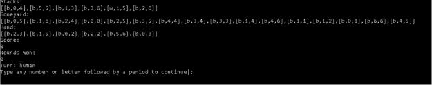

# Buildup (Prolog) Collin Edition™ 

Real Life picture of Buildup Domino Game 

Note: It’s one of the few domino games that uses 2 different colored set of dominoes. 
## Build Up Domino (RULES OF THE GAME)
Build Up is a two-player dominoes game, designed by David Vander Ark.
### The Objective
The objective of this game is to score the highest after the final hand in a round.
### The Players
Two players play this game - one player will be the human user of the program, and the other player will be the program/computer. The two players will play a "tournament", consisting of one or more rounds. Each round will consist of the two players playing four hands, each hand consisting of 4-6 tiles.
### The Setup
The game uses two double-six sets. A double-six set contains 28 tiles. Each tile has two ends, each end containing 0-6 pips. The double-six set contains tiles with the following combination of pips:

0-0, 0-1, 0-2, 0-3, 0-4, 0-5, 0-6, 

1-1, 1-2, 1-3, 1-4, 1-5, 1-6,

2-2, 2-3, 2-4, 2-5, 2-6,

3-3, 3-4, 3-5, 3-6,

4-4, 4-5, 4-6,

5-5, 5-6,

6-6.
#### Two such sets are used in the game - a white set used by the computer and a black set used by the human player. The two sets are shuffled before use.
Each player draws six tiles from the player's shuffled set and places them face up to constitute two rows of six tiles. The remaining tiles in each shuffled set form the boneyard for the respective player (black for human and white for computer).
### A Round
Each round consists of four hands. Six tiles each are used in the first three hands. The remaining 4 tiles are used in the last hand. For the first hand, in addition to the tile used to determine the first player, players draw five additional tiles from their boneyards. For subsequent hands, players draw the required number of tiles from the shuffled boneyard.
### First Player
Each player draws a tile from his/her boneyard. The player whose tile has the most pips plays first. If both the players have the same number of pips, the tiles are returned to the boneyards, the boneyards are shuffled and the process is repeated.
### A Hand
In each hand, the two players alternate placing one tile each, starting with the first player as determined above. The hand ends when both the players have placed all their tiles, or when neither player can place a tile. If one player cannot place a tile on his/her turn, the player will pass, allowing the other player to continue.
### Placement of a tile
A player places a tile from her/his hand on top of one of the twelve tile stacks started during setup, subject to the following rules:
- A non-double tile may be placed on any tile as long as the total number of pips on it is greater than or equal to that of the tile on which it is placed.
- A double tile (e.g., 0-0, 1-1, 2-2) may be placed on any non-double tile, even if the non-double tile has more pips.
- A double tile may be placed on another double tile only if it has more total pips than the tile on which it is placed.
### Score
When a hand ends, each player is awarded points as follows:
The points equal the total pips on all the tiles of the player's color that are on top of the twelve stacks.
If the player has any tiles that could not be placed, the total pips of these tiles is subtracted from the points. The tiles themselves are discarded, not returned to the boneyeard.
These points are added to the current score of the player. After the scores are updated, the next hand is started.
When the final hand ends, the player with the highest score wins the round. Ifboth the players have the same number of points, the round is a draw.
### The Tournament
After each round, the human player is asked whether she/he wants to play another round.
If yes, another round is played as described above and the process is repeated.
If no, the winner of the tournament is announced and the game quits. The winner of the tournament is the player who has won the most number of rounds. If both the players have won the same number of rounds, the tournament is a draw.
Ideally, players should try to place on top of their opponent's tiles rather than their own, so that more of their tiles will end up on top of stacks. But a player may choose to place on top of his/her own tile in order to play a tile that can otherwise not be played. Another way to play a tile that can otherwise not be played is to first place a low-valued double-tile on top of a high-valued tile.

## Bug Report 

The only bug detected is when the human player only has one tile left,the user menu won’t work and it will force human player to play a move. This only happens sporadically, however. 

## Program execution 

This program was made using the Microsoft VSCode. The main executor is Collin.pl file. To run this game you must install Swipl in Ubuntu - you do this by typing  sudo apt install swi- prolog. 

From there, type clear && swipl Collin.pl and the program should run. 

## Feature List 

- ### Missing Features 

 All features are present (HOWEVER computer player could play more aggressively) 

- ### Extra features  

 When possible, it will display all possible moves for a desired stack play 

## Data Structures Used 

- A list was used for all pieces for individual tiles, stacks, boneyards, hands, individual players, and the game. 

## Log 

1. 4/7/2023 I taught myself the basics of Programming in Logic (Prolog) and created the file. 5 hours spent 
1. 4/8/2023 I started to write code wrote the welcome menu and figured out basic input validation for the welcome menu.This was also the point where I realized all Prolog inputs end in a period. 4 hours spent 
1. 4/9/2023-4/11/2023 At this point it accurately created 3 separate lists for each player (stacks, shuffled boneyards, and hands). Hands and stacks were created from the first 12 tiles from the boneyard and were later removed from the boneyard. 5 hours spent on it each day  
4. 4/12/2023-4/15/2023 Announces first player, creates the game list from the 6 lists, and displays all moves from the Human player. 5 hours spent on it each day 
4. 4/16/2023 Human player now has a menu and can make a legal move. The game updates the stacks accordingly and updates the turn. 10 hours spent 
4. 4/17/2023 Computer player now plays RANDOMLY BUT LEGALLY (on 4/23/2023 computer will have a playing strategy of maximum tile coverage see number 10 for details) and can make a legal move, update the stacks accordingly, and update the turn. 10 hours spent 
4. 4/18/2023-4/19/2023 Players now alternate turns until there are no more legal moves and then terminates (does not 

score yet nor does it draw x more tiles from boneyard) 3 hours spent each day 

8. 4/20/2023 When there are no more legal moves the game now scores correctly and draws x more tiles from the boneyard (does not announce a winner yet). At this time serialization also works correctly. 8 hours spent 
8. 4/21/2023-4/22/2023 Announces a winner of a round and updates rounds won accordingly, along with prompting for another round. If another round is requested it creates a new game with the current rounds won. Otherwise, it announces the winner of the tournament. 3 hours spent each day 
10. 4/23/2023-4/24/2023 Computer now has a playing strategy of winning and also now explains what the computer did and why it did what it did. 5 hours spent each day 
10. 4/25/2023-4/26/2023 Ironed out any major bugs and verified correctness of the code. 5 hours spent each day 
10. 4/27/2023-4/28/2023 Cleaned up, documented and did final extensive testing to verify there were no major bugs. 2 hours spent each day 

## Screen shots 

1. Main Menu

2. Round information so far

3. Computer player method (BEFORE UPDATE TILES)

(AFTER UPDATING TILES) 

4. Help mode

5. Human input for stacking opponent’s stack (shows legal moves on opponent’s side B11 was the played tile) 

6. Human input for stacking on its own stack 

7. Save game 

8. Load game

9. When Human player can’t make any moves 

10. Which player won 

11. Which player won the tournament 

